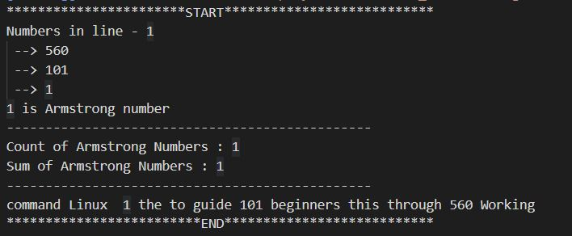

# Zen_1
C programms

# Project Title

Write C program

## Description

1) Write a program in C language with taken attached file for refernce.

     please find how many armstrong numbers are available in file.

     If you find 1 or 4  armstrong number in any line please reverse that line.

     If you find 2 or 5 armstrong number in any line please calculate sum of that both number and replace it with armstrong number.

     If you find 3 or 7 armstrong number in any line please reverse all that number at same place.

2) Write a program in C language with taken attached file for refernce.

     please find how many palindrome numbers are available in file.

     If you find 1 or 4 palindrome number in any line please reverse that line.

     If you find 2 or 5 palindrome number in any line please calculate sum of that both number and replace it with palindrome number.

     If you find 3 or 7 palindrome number in any line please reverse all words of that line at same place.

3) Write a program in C language with taken attached file for refernce.

     please find how many strong numbers are available in file.

     If you find 1 or 4 strong number in any line please reverse that line.

     If you find 2 or 5 strong number in any line please calculate sum of that both number and replace it with strong number.

     If you find 3 or 7 strong number in any line please reverse all words of that line at same place.

 ## Programs
 
* Armstrong Program in ---> Armstrong.c
* Palindrome Program in ---> Palindrom.c
* Strong number Program in ---> Strong_number.c
* file_contents.txt --> source content file

## Output

Numbers in line - X
 --> XXX
 --> XXX
 --> XXX
X is Armstrong number
-----------------------------------------------
Count of Armstrong Numbers : X
Sum of Armstrong Numbers : X
-----------------------------------------------
Line modification according to task

## Example

